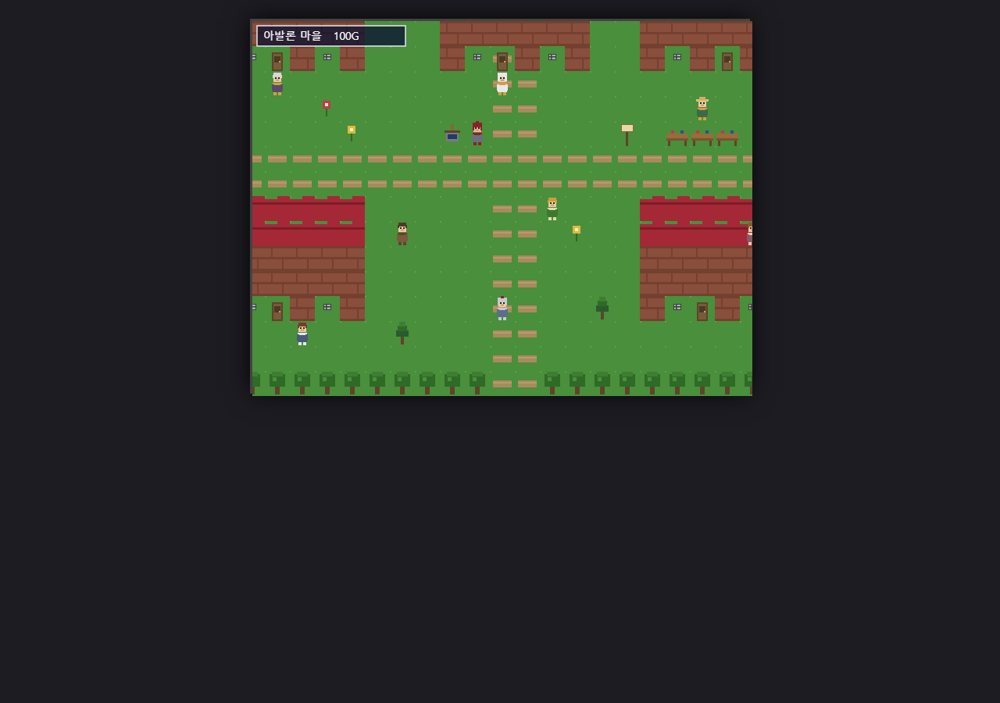
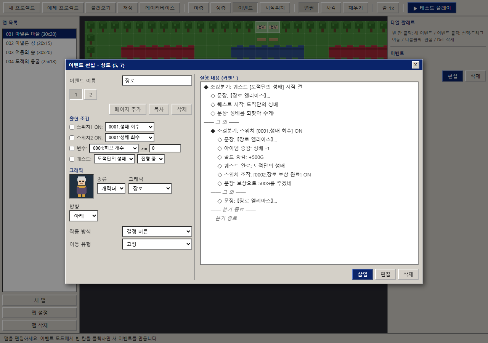
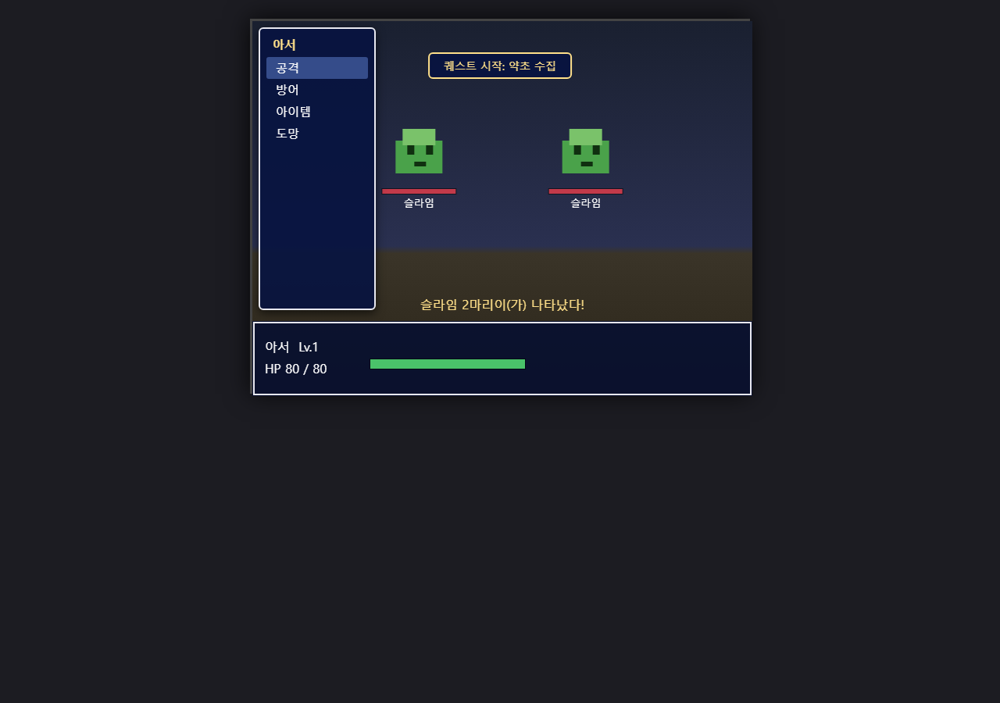
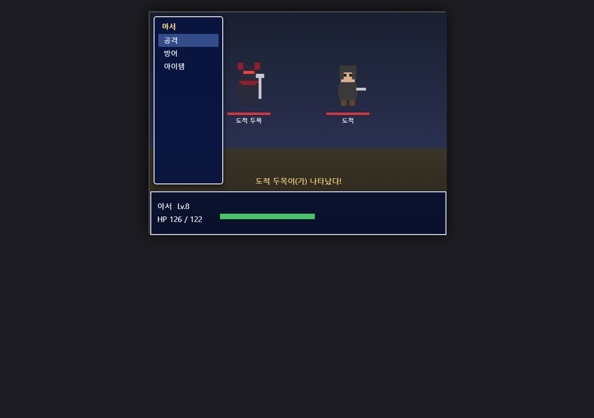
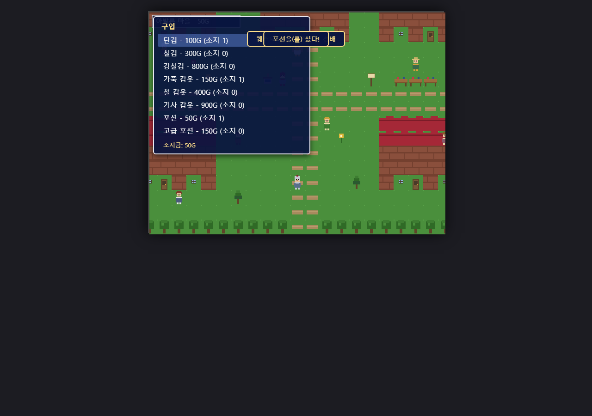
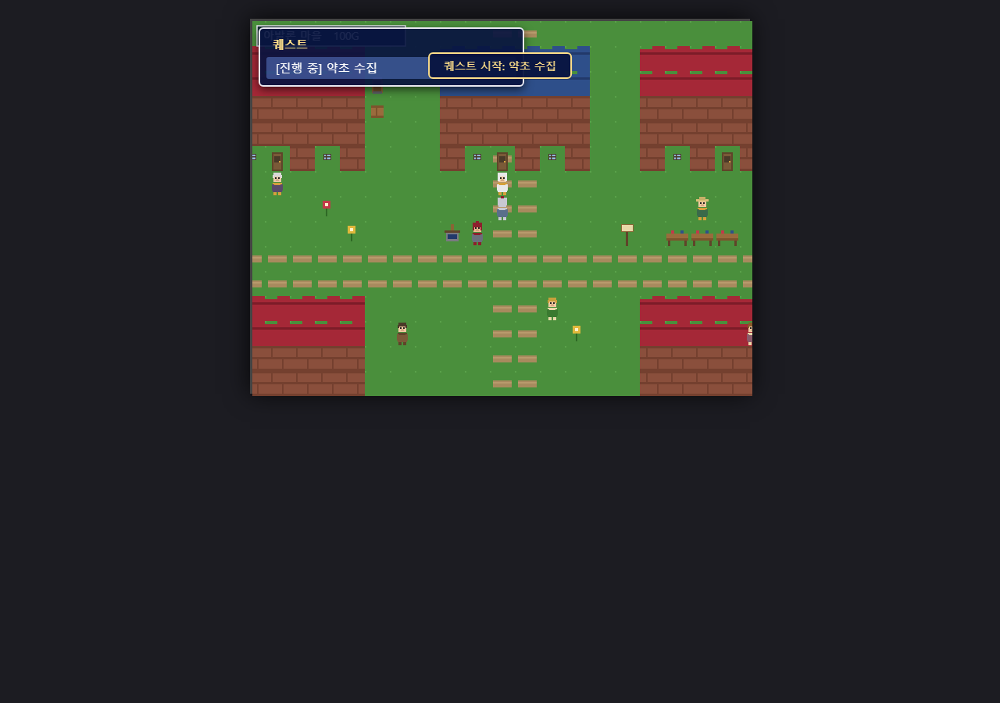
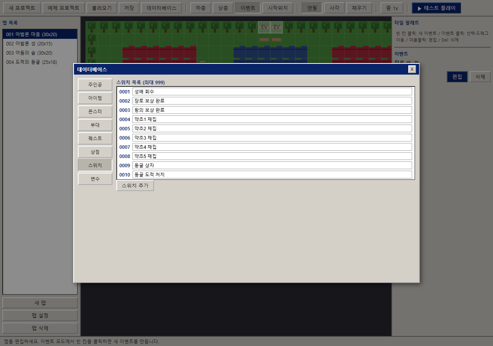

# RPG 만들기 2000 웹 (RPG Maker 2000 Web)

브라우저에서 동작하는 **RPG 만들기 2000** 클론 — Vite + TypeScript, 프레임워크 없이 DOM + Canvas로 구현한 에디터·런타임 통합 환경입니다. 타일/캐릭터/몬스터 그래픽은 RTP 저작권 문제를 피하기 위해 전부 절차적(procedural)으로 생성합니다.



## 빠른 시작

```bash
npm install
npm run dev        # 개발 서버
npm run build      # dist/ 프로덕션 빌드
npm run preview    # 빌드 결과 서빙
```

첫 실행 시 중세 RPG 예제 프로젝트 **「아발론 왕국」**이 자동으로 열립니다. 툴 바의 **▶ 테스트 플레이**로 바로 플레이할 수 있습니다.

## 에디터

| 기능 | 내용 |
|---|---|
| 맵 에디터 | 하층/상층/이벤트 3레이어, 연필·사각·채우기 도구, 1x/2x 줌, 맵 추가·설정(크기·인카운터·출현 부대)·삭제, 플레이어 시작 위치 지정 |
| 이벤트 에디터 | 다중 페이지(추가/복사/삭제), 출현 조건(스위치1/2, 변수 >=, 퀘스트 상태), 그래픽(캐릭터/타일/없음, 미리보기), 작동 방식 4종(결정 버튼/플레이어 접촉/자동 시작/병렬 처리), 이동 유형 |
| 이벤트 커맨드 | 문장(`\V[n]` 변수 치환), 선택지, 스위치 조작, 변수 조작(대입/가산/감산/랜덤, 변수값 참조), 조걶분기(스위치/변수/퀘스트/아이템/골드), 장소 이동, 상점 처리, 퀘스트 시작/완료, 아이템 증감, 골드 증감, 전투 시작, 완전 회복, 대기 — 중첩 블록 들여쓰기 편집 |
| 데이터베이스 | 주인공, 아이템(무기/방어구/소비/중요), 몬스터, 부대, 퀘스트, 상점, 스위치(999), 변수(999) |
| 프로젝트 관리 | JSON 파일 저장/불러오기, localStorage 자동 저장 |



## 테스트 플레이 (런타임)

- **조작**: 이동 방향키/WASD · 결정 Z/Enter/Space · 메뉴·취소 X/Esc
- RM 스타일 파란 윈도우의 메시지/선택지, 맵 간 이동(페이드), 랜덤 인카운터
- 메뉴: 아이템 사용·장비, 스테이터스, 퀘스트 로그, 세이브/로드(3슬롯), 에디터 복귀
- 상점(구매/판매), 턴제 전투(공격/방어/아이템/도망), 경험치·레벨업·골드, 게임 오버

| 전투 | 보스전 | 상점 |
|---|---|---|
|  |  |  |

## 예제 프로젝트 「아발론 왕국」 (중세)

- **맵 4개**: 아발론 마을 / 아발론 성 / 어둠의 숲 / 도적의 동굴
- **퀘스트 ① 도적단의 성배** (스위치 기반): 장로의 부탁 → 어둠의 숲 → 동굴 보스 「도적 두목」 처치 → 성배 반납 → 국왕 추가 보상
- **퀘스트 ② 약초 수집** (변수 기반): 사제의 부탁 → 숲에서 약초 3개 채집(변수 카운트) → 납품(변수 조건 출현 페이지)
- 무기상점, 여관(골드 조걶분기 + 완전 회복), 볬 상자, 랜덤 인카운터, 매복 도적 이벤트 전투
- 스위치 10개·변수 2개 실사용



## 검증

Playwright 기반 실브라우저 테스트가 포함되어 있습니다.

```bash
npm run typecheck    # tsc --noEmit
npm run preview &    # 테스트용 서버 (BASE_URL 환경변수로 포트 지정 가능)
npm run test:smoke   # 에디터/플레이/전투/세이브 스모크 — 14개 검증
npm run test:e2e     # 퀘스트 체인 전체 E2E — 13개 검증
```

- 스모크: 에디터 부팅, 타일 페인팅, 이벤트 선택·편집, 데이터베이스, NPC 대화, 퀘스트 로그, 전투 승리, 세이브, 에디터 복귀, 콘솔 오류 0
- E2E: 퀘스트 ①·② 시작→완료 전 체인, 상점 구매 골드 정합, 약초 변수 카운트, 접촉 트리거 맵 이동, 보스전→성배 획득→반납→국왕 보상, 프로젝트 저장/불러오기 라운드트립



## 프로젝트 구조

```
src/
  model/types.ts       데이터 모델 (프로젝트/맵/이벤트/커맨드/세이브)
  model/factory.ts     새 프로젝트 + 예제 프로젝트 「아발론 왕국」
  model/storage.ts     JSON 저장/불러오기, 자동 저장, 세이브 슬롯
  gfx/tiles.ts         절차적 타일셋 (하층 15종, 상층 33종)
  gfx/chars.ts         캐릭터 12종·몬스터 6종 스프라이트
  editor/editor.ts     에디터 셸 + 맵 페인팅
  editor/eventeditor.ts 이벤트/커맨드 편집
  editor/database.ts   데이터베이스 대화상자
  runtime/engine.ts    게임 루프·이동·렌더·트리거
  runtime/interpreter.ts 이벤트 커맨드 인터프리터
  runtime/screens.ts   메시지/메뉴/상점/세이브 화면
  runtime/battle.ts    턴제 전투
scripts/
  smoke.mjs, e2e.mjs   Playwright 검증
```

## 기술 스택

Vite 7 · TypeScript 5 (strict) · 순수 DOM + Canvas API · Playwright (검증)
